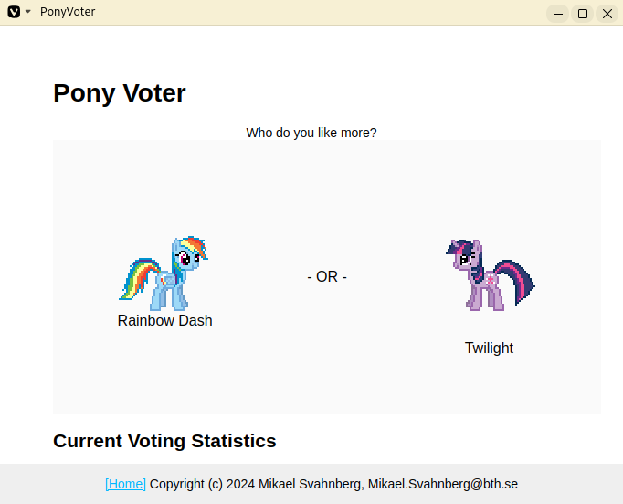

#+Title: PA1489 Assignment Descriptions
#+Author: Mikael Svahnberg
#+Email: Mikael.Svahnberg@bth.se
#+Date: 2026-06-15
#+EPRESENT_FRAME_LEVEL: 1
#+OPTIONS: email:t <:t todo:t f:t ':t H:3 toc:nil
#+STARTUP: beamer num

#+LATEX_CLASS_OPTIONS: [10pt,t,a4paper]
#+BEAMER_THEME: BTH2025

* Introduction
This document describes the graded assignments in the course PA1489 Basic Software Engineering

The course consist of the following assignments:

| Assignment           | Size   | Description                               |
|----------------------+--------+-------------------------------------------|
| Written Assignment 1 | 2.5 hp | Tools: Git, Docker, Testing and Debugging |
| Written Assignment 2 | 2.5 hp | Implementation and Documentation          |
| Written Assignment 3 | 2.5 hp | Engineering Diary                         |
|----------------------+--------+-------------------------------------------|

All assignments are submitted and graded individually, but it is ok to collaborate in their creation.

* Assignment 3: Engineering Diary
*Note* This assignment is introduced first since you will be working on it continuously throughout the entire course. You will, however, only submit it at the end of the course.

In this assignment, the focus is on your learning and reflections. As you work with new tools, or implement new code, an engineering diary is a vital help to be able to re-trace previous decisions, to note down quick ideas, or items that require further reading. In real life this engineering diary is your personal tool and life-saver, but in this course we also use it as part of the examination in order to bootstrap your use of a diary as a vital engineering tool.

Your engineering diary is individual, and is *submitted to Canvas* once you are done with assignments 1 and 2.

A checklist is used to assess the contents of your diary, and this is used to calculate a score for the entirety of the assignment. This score is then translated to a grade as follows:

| Score | Percent | Grade |
|-------+---------+-------|
|    24 |    100% |       |
|    22 |    >90% | A     |
|    19 |    >80% | B     |
|    17 |    >70% | C     |
|    16 |    >65% | D     |
|    14 |    >60% | E     |
|   <14 |    <60% | F     |
|-------+---------+-------|
** Generic Suggestions
- Try to get into the habit of often reflecting upon what you have done, what you have learnt, and what you must find out.
- It is better to write a little every day rather than a lot once a week.
- Even an entry such as "2025-06-22: Finished implementing the Frobnicator class; all went well and now I want to go out in the sun and play!" is valuable.
** Required Sections
Your engineering diary /must/ contain reflections on:

1. Configuration Management
   - What is your interpretation of how configuration management works?
   - Why should we use configuration management?
   - Which commands are you using?
   - What works well?
   - What is difficult?
   - How did you solve your challenges? What could you have done differently?
   - What did you not manage to solve? Why not?
2. Container Development 
   - Which commands are you using?
   - What works well?
   - What is difficult?
   - How did you solve your challenges? What could you have done differently?
   - What did you not manage to solve? Why not?
   - How is a Dockerfile structured?
   - How is a docker compose file structured?
3. Testing and Debugging
   - What is your interpretation of how automated testing works?
   - What is your interpretation of how the code debugger works?
   - Which commands are you using?
   - What works well?
   - What is difficult?
   - How did you solve your challenges? What could you have done differently?
   - What did you not manage to solve? Why not?
4. Implementation and Documentation
   - Are there any programming languages you are particularly interested in? Why?
   - What are your experiences when trying to follow the execution flow (e.g. what happens when you click on a button)?
   - How do you keep your code "clean" and well structured?
   - What works well?
   - What is difficult?
   - How did you solve your challenges? What could you have done differently?
   - What did you not manage to solve? Why not?

Please *timestamp* each entry in your diary.
** Assessment
The following criteria will be used to assess your engineering diary:

1. [ ] There is a discussion about configuration management
2. [ ] There is a discussion about container development
3. [ ] There is a discussion about testing and debugging
4. [ ] There is a discussion about implementation and documentation
5. [ ] It is clear when each entry was made.
6. [ ] There are regular updates to the engineering diary (more than five, spanning the entire course)
7. [ ] The engineering diary contain summaries of the work that has been done since the last update.
8. [ ] The engineering diary contain insightful reflections and identifies opportunities for improvements.

Each completed item gives a maximum of 3 points for a total of 24 points.
* Assignment 1: Tools
This assignment covers basic software engineering tools. Do note that in order to work with these tools, you also need a basic understanding of how your computer works, your development environment, what a file is and how to find and use it, and (to some extent) working with a command line interface.

This assignment consists of three parts (described further in subsequent sections):

1. Git (Configuration Mangement)
2. Docker and Docker Compose (Develop using Containers)
3. Testing and Debugging

Each of these parts are examined separately and individually. They are examined by showing a teaching assistant that you know how to work with and use the concepts. The TA uses a checklist to mark the parts that you have shown, and this is used to calculate a score for the entirety of the tools assignment. This score is then translated to a grade as follows:

| Score | Percent | Grade |
|-------+---------+-------|
|    18 |    100% |       |
|    16 |    >90% | A     |
|    14 |    >80% | B     |
|    13 |    >70% | C     |
|    12 |    >65% | D     |
|    10 |    >60% | E     |
|   <10 |    <60% | F     |
|-------+---------+-------|
* Assignment 1 Tools: Git
** Tasks: Get Started with Git
*** Register an account
- Register an account at some git server:
  - https://github.com/signup or https://education.github.com/pack
  - https://gitlab.com/users/sign_up
  - https://www.atlassian.com/software/bitbucket/bundle
  - https://codeberg.org/

- Github is still very popular for open source projects
  - In some trouble for how they may use the code you upload ther
- Many migrated over to Gitlab when Microsoft bought Github
- Atlassian and BitBucket are very well integrated with the rest of their produxcts
  - Used to have very generous offers for students and universities (unclear status these days)
- Codeberg.org is specifically focussed on open source projects.
*** Create and Clone a Repository
- Easiest to start in the web interface
- Name the project to something creative, e.g. =gitExample=
- When you are done, there should be a link, e.g. under =<> Code= that can be used to clone the project.
  - Example: ~git clone https://codeberg.org/mickesv/gitex.git~
  - This will set up =remote/origin= for you.
*** Create some git history
1. Create some files
2. Add them to the staging area and commit
3. Change one of the files; add and commit again
4. Repeat a couple of times.
5. Create a branch
6. Create some files, add and commit.
7. Edit some of your first files and commit.
8. Check the log.
9. Check status.
10. Push to the server
11. Check the status.
*** (Optional) Fork a colleagues repository
1. Find the account of a colleague (on the same server)
2. Pick a repository and fork it (for example the example account that you just created)
3. Clone it to your computer and create some more git history
4. When you have pushed everything to your fork, create a =pull request= in your colleagues repository (via the web interface)
*** (Optional) Handle a Pull Request
When your colleague have created a pull request to your repo, handle it.
- Inspect every commit to see what has been changed
- Can it be merged automatically? This should be indicated somewhere.
- Create a merge commit.

Create some more commits in your respective forks.
- Create a new pull request.
- This time, /deny/ the pull request.
*** (Optional) More participants in the same project
- Divide into groups of around 5 people
- Pick a colleagues repository
- Enter =Settings/Collaborators= and add all of you to the same project
- Clone the repo

Now you are only allowed to work in a specific file =charlie-foxtrot.txt=
- You may add new text
- You may edit the existing text
- You may insert text; between two lines, and in the middle of a line
- You may remove text

Commit regularly (max 2-3 changes per commit)
Push after every commit.
- You may need to do a =fetch/merge= in order to be allowed to do a =push=

*Handle the merge conflicts*

Discuss in small groups: What can you do to get fewer conflicts?
** Show the TA :Assignment:
Show the TA the following:

File management:
   1. [ ] Create a directory
   2. [ ] Create some files in the directory
   3. [ ] Open files in your development enviromment; edit; save.
   4. [ ] Close your development environment and find the files via a file explorer (not your development environment).

Working with git:
   5. [@5] [ ] Git clone from an online repository to a new directory.
   6. [ ] Edit some files in the git repo using your development environment.
   7. [ ] Find the files in a file explorer (not your development environment).
   8. [ ] Git add and git commit of your edited files.
   9. [ ] Git push to your online repository.
   10. [ ]  Show the files in your online repo (using web browser).

Each completed item gives 1 point for a total of 10 points.
** Update the Engineering Diary :Diary:
- What is your interpretation of how configuration management works?
- Why should we use configuration management?
- Which git commands are you using?
- What works well? What is difficult?
- How did you solve your challenges? What could you have done differently?
- What did you not manage to solve? Why not?
- What do you need or want to learn more about?

* Assignment 1 Tools: Docker and Docker Compose
** Tasks: Get Started
   1. Make sure Docker is installed
   2. (Optional) The official tutorials are quite good:
      - Docker https://docs.docker.com/get-started/
      - Docker with node.js  https://docs.docker.com/language/nodejs/
      - Docker with python https://docs.docker.com/guides/python/
   3. Clone the /PonyVoter/ project https://codeberg.org/mickesv/PonyVoter.git
** Tasks: The PonyVoter Microservice app
*** Info PonyVoter :Info:
- PonyVoter presents two options and you vote by clicking on one of them
- The votes are registered in a database so that you can keep track of which pony is the most popular.

#+ATTR_ORG: :width 300

*** Inspect and Test
- Study the file =ponyvoter.yaml=
  - Which /Services/ are launched?
  - Where can you find the source code for each of these?
  - What is specified for each container?
  - Can you see how to access each container (e.g. which network ports to use)?
- Study the file =makefile=
  - How do you build the project?
  - How do you run the project?

Run the project:
1. Start the application (using =make= or =docker compose -f ponyvoter.yaml up=)
1. Visit http://localhost:8080 and test the application
   - Keep an eye on the terminal while running. What is printed?
2. Abort by pressing =Ctrl-C= in the terminal.
   - What happens?
   - Check with =docker images= what images you have
   - Check with =docker ps -a= what container are running or no longer running
3. Start again (same command)
   - What happens?
   - Note that the statistics are not reset despite all containers being restarted.
     - Why not?
     - How can you find out more information about this?
** Show the TA :Assignment:
Show the TA the following:

1. [ ] Start the system using =docker compose=
2. [ ] Describe each Container
   - Which containers are there?
   - What does each container do?
   - What is the difference between an image and a container?
3. [ ] Explain ~ponyvoter.yaml~
4. [ ] When is each container "invoked" in the log output?
5. [ ] Which containers are available to the user? How can you see this?

Each completed item gives 1 point for a total of 5 points.
** Update the Engineering Diary :Diary:
- Which docker/docker compose commands are you using?
- What works well?
- What is difficult?
- How did you solve your challenges? What could you have done differently?
- What did you not manage to solve? Why not?
- How is a Dockerfile structured?
- How is a docker compose file structured?

* Assignment 1 Tools: Testing and Debugging
** Tasks: Testing and Debugging SorterTool
*** Get Started
1. Clone the project https://codeberg.org/mickesv/SorterTool
2. Read the source code and make sure you understand it.
3. Make sure that ~pytest~ is installed: ~pip install pytest~
   - (You may need to set up a python venv before this)
4. Run the existing tests: ~pytest -v~
   - Read the output and make sure you understand it.
   - One test fails. Why? How can you find out more information?

#+begin_src bash
git clone https://codeberg.org/mickesv/SorterTool
cd SorterTool/Python

python -m venv .venv
source .venv/bin/activate

pip install pytest
#+end_src
*** Write More Tests
Only one algorithm is currently tested, i.e. QuickSort, and only with a hard-coded array of numbers.
1. *TODO:* Write tests for BubbleSort and InsertionSort
2. *TODO:* Generate a new array of random length (between 5--20) containing random numbers (between 1--1000) for each test.

Tip:
- You can write separate tests for each algorithm, or you can use the same tests and use ~@pytest.mark.parametrize()~
*** Use the Debugger
1. Add a breakpoint on the first line in the ~bubbleSort~ method
2. Debug the program and try to understand how the bubblesort algorithm works
   (Tip: /Sorting out Sorting/ : https://youtu.be/HnQMDkUFzh4?si=xMEF8GgU_4fXxxB6 )
3. *Practice* using /breakpoints/, /step over/, /step in/, and /step out/
4. Add a =watch= expression and continue debugging until you see it change value

Fix the error:
- Can you now figure out why one of the initial tests failed?
- Can you fix the code so that it passes?
  - If so, please fix the error and re-run the tests.
** Show the TA :Assignment:
Show and explain to the TA the following:

1. [ ] Which tests have you added? Show them and explain what they do.
2. [ ] Run ~pytest -v~ . Explain the output. If any tests still fail, explain why.
3. [ ] Show while you run the debugger on the =quickSort= method
   - Show while you use /breakpoints/, /step over/, /step in/, and /step out/
   - Show the current values of local variables

Each completed item gives 1 point for a total of 3 points.
** Update the Engineering Diary :Diary:
- What is your interpretation of how automated testing works?
- What is your interpretation of how the code debugger works?
- Which debugging commands are you using?
- What works well? What is difficult?
- What do you need or want to learn more about?
- How did you solve your challenges? What could you have done differently?
- What did you not manage to solve? Why not?

* Assignment 2: A Bigger Project
In this assignment you will be using the tools together; you will use git to download the project and to store your changes, you will use docker and docker compose to run the project, and you will use your IDE to read and modify the source code, and to add documentation to the project.

This assignment is planned to span several weeks but you may of course work faster. The task is to understand and modify a webshop app, i.e. /The Auld Argument Shoppe/. The document *Assignment: The Auld Argument Shoppe* introduces the application and the assignment tasks. The assignment is shown through a combination of worksheets that you are expected to print and complete by hand, and some parts which you demo to one of the TAs. Your final assessment for this assignment is a combination of the worksheets and the demos.

You may collaborate with other student colleagues, but you present your final work and is examined individually.

The TA uses a checklist to mark the parts that you have shown, and this is used to calculate a score for the entirety of the assignment. This score is then translated to a grade as follows:

| Score | Percent | Grade |
|-------+---------+-------|
|    28 |    100% |       |
|    25 |    >90% | A     |
|    22 |    >80% | B     |
|    20 |    >70% | C     |
|    18 |    >65% | D     |
|    16 |    >60% | E     |
|   <16 |    <60% | F     |
|-------+---------+-------|

** Tasks Week 1
Using the Assignment worksheet, the focus of this week is to familiarise yourself with the application.

*Tasks*
0. [@0] Read pages 1--5 of the document "Assignment: The Auld Argument Shoppe"
1. Clone the repository: https://codeberg.org/mickesv/ArgumentShop.git
2. Familiarise youself with the application and its code.
3. Study, in particular, the code for the "Webshop" container.
4. Briefly familiarise yourself with the listed programming languages
5. Update your Engineering Diary as specified in the assignment document.

** Tasks Week 2
This week, the focus is on Docker and Docker Compose, and to get the application built and running. You will also dive deeper into some of the services in order to understand how they call and make use of each other.

*Tasks*
0. [@0] Read pages 6--12 of the document "Assignment: The Auld Argument Shoppe"
1. Complete the Dockerfile crossword (on paper, you will show this to a TA later)
2. Fix the two broken Dockerfiles (in your computer; the project will not run otherwise)
3. Complete the microservice dependency map (on paper, you will show this to a TA later)
4. Fix ~compose.yaml~ (in your computer; the project will not run otherwise)
5. Build the project and run the project
6. Complete the two call graphs (on paper, you will show this to a TA later)
7. Update your Engineering Diary as specified in the assignment document.
8. Remember to commit your work (you will show your commits to a TA later)

** Tasks Week 3
This week, you are going to implement some new functionality in the project, and add documentation to some of the existing source code.

*Tasks*
0. [@0] Read pages 13--16 of the document "Assignment: The Auld Argument Shoppe"
1. Update ~compose.yaml~ to prepare for the implementation, and to add the ~logview~ service.
2. Implement ~logmanager.py~
3. Edit ~app.py~ to use the new method
4. While coding, pay attention to your coding style: use small self-explanatory functions, informative variable names, etc.
5. Add """docstrings""" to explain all functions in all the python files.
6. Update your Engineering Diary as specified in the assignment document.
7. Remember to commit your work (you will show your commits to a TA later)

** Show the TA :Assignment:
When you have completed all the tasks in the worksheet, you are expected to show a TA when you:

1. Start the application using docker compose
2. Demo the application in a web browser
3. The web page http://localhost:8080/log
4. The web page http://localhost:8080/health (which of course should be mostly healthy)
5. A list of the running containers
6. Your commit log, including
   - A commit with the fixed Dockerfile for ~PackingSystem~ (Roopert the Kangaroo)
   - A commit with the fixed Dockerfile for ~Webshop~ (Roopert the Kangaroo)
   - Several commits with updates to ~compose.yaml~
7. Explain your ~compose.yaml~ (Harriet the Hamster, and Owlivia the Owl)
8. Explain all the source code in the Webshop container (Owlivia the Owl)
9. Your worksheets for
   - The Dockerfile crossword (Barry the Bear)
   - The Docker compose dependency map (Briant the Ant)
   - Call graph for ~checkout()~ (Skip the Squirrel)
   - Call graph for ~viewCart()~ (Skip the Squirrel)

The assessment is done as follows:

1. Basics, 1 point each for:
   1. [ ] The completed Dockerfile crossword
   2. [ ] The Docker compose dependency map
   3. [ ] Call graph for ~checkout()~
   4. [ ] Call graph for ~viewCart()~
2. Working Software, 1 point each for:
   1. [ ] All services can be built and run
   2. [ ] All service dependencies are correctly specified
   3. [ ] The application is accessible from a web browser
3. Functionality and Implementation, 1 point each for:
   1. [ ] ~logmanager::get_all()~ works as intended
   2. [ ] ~app.py~ has a working route ~/log~
   3. [ ] All functions are well documented with """docstrings"""
   4. [ ] Code comments are used to explain
   5. [ ] Each commit has a single purpose
   6. [ ] Each commit has a meaningful log message
4. Understanding, a maximum of *5 points* each for:
   1. [ ] At a high level explain what each service and file does
   2. [ ] Explain how some functionality (TA selects) is implemented and showing the relevant source code.
   3. [ ] Explain how some other functionality (TA selects) is implemented and showing the relevant source code.

This gives a total of 28 points.
** Update and Submit your Engineering Diary :Diary:Assignment:
Make sure your engineering diary contains the expected sections on configuration management, container development, testing and debugging, and implementation and documentation.

- Are all entries timestamped?
- Are there regular updates to the engineering diary?
- Does the engineering diary contain summaries of the work that has been done since the last update?

*Submit your Engineering Diary to Canvas* when you are done with assignments 1 and 2.

