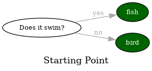
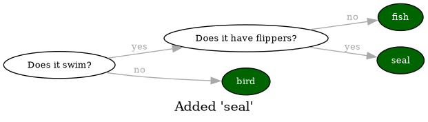
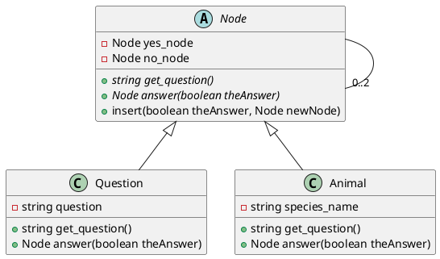
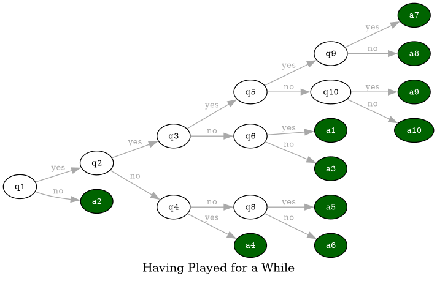

#+Title: Practical: A Console App
#+Author: Mikael Svahnberg
#+Email: Mikael.Svahnberg@bth.se
#+Date: 2025-04-28
#+EPRESENT_FRAME_LEVEL: 1
#+OPTIONS: email:t <:t todo:t f:t ':t H:1
#+STARTUP: beamer num

#+LATEX_CLASS_OPTIONS: [10pt,t,a4paper]
#+BEAMER_THEME: BTH2025

* Introduction
- We write a console app and embellish it from there
- Introduction to the lab this week and the coming weeks
* The Lab This Week :Info:
- This week you are starting with /The Auld Argument Shoppe/
- You will continue with this app during the rest of the lab sessions in the course.
  - This week: Get Started; Pages 1--5
  - Next week: Docker and Docker Compose; Pages 6--12
  - Third Week: Implementation and Documentation; Pages 13--16
- /When you are done/ (after week 3), show the TA (§4 in canvas assigment)
  - Start & demo the application
  - show your commit log
  - show and explain =compose.yaml=
  - Explain source code in the Webshop container
  - Dockerfile Crossword, Dependency Map, Call graphs
* Introducing /The Auld Argument Shoppe/
- A complicated way of writing a webshop app using microservices and containers
- More than several containers
- Many different programming languages
- Several databases of different types
* This week's Practical: Guess the Animal
- David H. Ahl, /"101 BASIC Computer Games"/, Digital Equipment Corporation, Maynard MA, 1975.
- https://archive.org/details/101basiccomputer0000davi/page/18/mode/2up
- One of the games is /"Guess the Animal"/
  - TL;DR: You think of an animal, the computer tries to guess it.
  - The computer learn new animals
  - Loads and saves data to disk

#+begin_example
Play "Guess the Animal"
Think of an animal and the computer will try to guess it

Are you thinking of an animal? yes
Does it swim? yes
Is it a fish? no
The animal you were thinking of was a ? seal
Please type in a question that would distinguish a seal from a fish ? Does it have flippers
For a seal the answer would be? yes

Are you thinking of an animal? 

...
Are you thinking of an animal? save
Saving...

Are you thinking of an animal? list
Animals I already know are
seal      elephant    dog    cat    tiger
cow       bird        goat   fish   whale
#+end_example
* Data Structure I
- Quite often, the /Data Structure/ is the part that requires planning
- In this case, the input/output is simple once we understand the data structure.
- The questions form a /tree/ , with only the leaf nodes representing animals.
- Let's look at two examples to see what happens:

#+begin_src dot :file data-structure-start.png
  digraph G {
    rankdir="LR";
    label="Starting Point"
    bgcolor="transparent";
    node[width=0.15, height=0.15, fontsize=10.0 color=black, fontcolor=black];
    edge[weight=2, color=darkgray, fontsize=10.0, fontcolor=darkgray];
    
    // Questions
    q1[label="Does it swim?"]

    // Animals
    node[width=0.15, height=0.15, fontsize=10.0 color=black, fontcolor=white, style=filled, fillcolor=darkgreen];

    a1[label="fish"]
    a2[label="bird"]

    // Edges
    q1->a1 [label="yes"]
    q1->a2 [label="no"]
  }
#+end_src

#+RESULTS:

#+begin_src dot :file data-structure-oneIn.png
  digraph G {
    rankdir="LR";
    label="Added 'seal'"
    bgcolor="transparent";
    node[width=0.15, height=0.15, fontsize=10.0 color=black, fontcolor=black];
    edge[weight=2, color=darkgray, fontsize=10.0, fontcolor=darkgray];
    
    // Questions
    q1[label="Does it swim?"]
    q2[label="Does it have flippers?"]

    // Animals
    node[width=0.15, height=0.15, fontsize=10.0 color=black, fontcolor=white, style=filled, fillcolor=darkgreen];

    a1[label="fish"]
    a2[label="bird"]
    a3[label="seal"]

    // Edges
    q1->q2 [label="yes"]
    q1->a2 [label="no"]
    q2->a3 [label="yes"]
    q2->a1 [label="no"]
  }
#+end_src

#+RESULTS:

* Data Structure II
- We clearly have two types of /nodes/, i.e. /questions/ and /animals/
- The /root node/ (starting node) is a =Question=
  1. =get_question()= to get the question to ask
  2. =answer()= to pass in the given answer (~true \equal yes~ and ~false \equal no~)
  3. We get a =Node= reference back, so we repeat with =get_question()= \dots
- The =Animal= node will have some extra logic to the =answer()= method.
  - If the returned =Node= is a =this= (=self= in Python) reference, the computer managed to guess the animal.
  - If the returned =Node= is =null= (=None= in Python), then the player wins; we need to add a new node.
  - This is not ideal, but we repurpose =get_question()= to return the species name.
    - (*TODO* Refactor this method name to something generic)

#+begin_src plantuml :file data-structure-tree.png
abstract class Node {
  -Node yes_node
  -Node no_node
  +string get_question() {abstract}
  +Node answer(boolean theAnswer) {abstract}
  +insert(boolean theAnswer, Node newNode)
}

Node <|-- Question
Node <|-- Animal
Node -- "0..2" Node

Question : -string question
Question : +string get_question()
Question : +Node answer(boolean theAnswer)

Animal : -string species_name
Animal : +string get_question()
Animal : +Node answer(boolean theAnswer)
#+end_src

#+RESULTS:

* Adding a Node
Looking at the earlier example again:

 \to 
We need to:
- Create a new =Animal=
- Create a new =Question=
- Connect the =Question= to the =Animal=;
  - if the answer to the question is "yes", we bind the =yes_node=
  - if the answer to the question is "no", we bind the =no_node=
- Connect the =Question= to the /current node/ (which was the animal the computer guessed)
- Connect the /previous question/ to the new question.

The last two items are important
- We need to keep track of the =current= node as well as the =previous= node.
  - The =current= node is an =Animal=
  - The =previous= node is a =Question=
- We need to be able to insert new nodes =Node::insert()= takes care of this.
  - /However/, we learn that we must also keep track of the =previous_answer= given by the user.
* Having Played for a While
- After a while, you have a tree of /Nodes/
  - /Questions/ have branches (one yes-branch, and one no-branch)
  - /Animals/ are leaves.

#+begin_src dot :file data-structure-some-way-in.png
  digraph G {
    rankdir="LR";
    label="Having Played for a While"
    bgcolor="transparent";
    node[width=0.15, height=0.15, fontsize=10.0 color=black, fontcolor=black];
    edge[weight=2, color=darkgray, fontsize=10.0, fontcolor=darkgray];
    
    // Questions
    q1, q2, q3, q4, q5, q6, q8, q9, q10

    // Animals
    node[width=0.15, height=0.15, fontsize=10.0 color=black, fontcolor=white, style=filled, fillcolor=darkgreen];

  //a1, a2, a3, a4, a5, 

    // Edges
    q1->q2 [label="yes"]
    q1->a2 [label="no"]
    q2->q3 [label="yes"]
    q2->q4 [label="no"]
    q3->q5 [label="yes"]
    q3->q6 [label="no"]
    q4->a4 [label="yes"]
    q4->q8 [label="no"]
    q5->q9 [label="yes"]
    q5->q10 [label="no"]
    q6->a1 [label="yes"]
    q6->a3 [label="no"]
    q8->a5 [label="yes"]
    q8->a6 [label="no"]
    q9->a7 [label="yes"]
    q9->a8 [label="no"]
    q10->a9 [label="yes"]
    q10->a10 [label="no"]

  }
#+end_src

#+RESULTS:

* Tree Traversal Algorithm (brief)
#+begin_src python
  #
  # This is actually some form of pseudo code; it will not work as python code.
  #

  current_node = self.root
  done = False
  while not done:
      answer = input( current_node.get_question() )
      answer = parse_answer( answer ) # Make the answer into a boolean [True if answer was 'y' or 'yes', otherwise False]
      new_node = current_node.give_answer( answer )

      if None == new_node:
          # current_node must have been an Animal node,
          # and the question "Are you thinking of a XXX?" was answered with "no"
          new_question = create_new_question( old_current_node = current_node )
          insert_node(start = self.root, place = current_node, new_node = new_question)
          done = True

      elif new_node == current_node:
          # current_node must have been an Animal node,
          # and the question "Are you thinkin of a XXX?" was answered with "yes"
          # This means the computer wins -- it guessed what animal you were thinking of
          print("Cool, I win! Next time, pick something more difficult.")
          done = True

      else:
          # current_node was probably a question,
          # and the answer (yes or no) returned a new node for me.
          current_node = new_node

  # end of while
#+end_src

* Some more Decisions
- We start as a /console/ app (using =print= and =input=)
  - We may wish to change this later, so let's keep the user interaction separate.
  - Actually, let's keep the entire UI interaction in a class =ConsoleGame=.
- We start without a container
  - We may wish to change this too later, but this will not significantly impact our current development.
* Let's start Coding
Suggested Implementation Order:
1. Node (wait with the =insert()= method)
   - Easy start since it mostly consist of empty methods
2. Question and Animal
   - We have Node fresh in memory, so these are a good place to continue with
   - Together, these three classes define the data structure.
   - Can focus on what is the same and what differs between a Question and an Animal
3. =app.py= and =ConsoleGame=
   - =app.py= is just a launcher, so it should not contain much advanced coding.
   - =ConsoleGame= is more involved since this is where we tie everything together and start making mistakes.

When coding =ConsoleGame=,
1. I include lots of calls to methods I haven't implemented yet. This is ok, I need to implement them anyway before I am ready to start testing.
2. Then I add placeholders for the methods (with =pass= instead of method bodies)
3. Then it's just a matter of implementing method by method and create new methods if it increases clarity.
4. While implementing =ConsoleGame= I am going to revisit the =Node= hierarhy and add missing details there.
5. I am skipping =save()= and =load()= at first -- they are not critical to get the game working, but will be once we start testing.
* Next Steps
- Take a step back. Look at the code. *What can be improved?*
  - Are all methods consistently named?
  - Do all variables have meaningful names?
  - Is all logic in the right method/class/file?
  - Can a method be made clearer by introducing new method calls?
  - Can implementations be reused by creating new methods?

*Never be afraid of adding new files, new classes, or new methods if it increases clarity!*
* Embellishments
- What if the user fat-fingers the answers by adding spaces or tabs to the beginning or end?
- What if the user adds capital letters to their answer? What if they don't?
- What if the user does not add a question mark at the end of their animal questions?
- Correct use of a/an when guessing "Is it a" vs "Is it an"
- Why don't we auto-save every time a new animal is added?
- What if there are errors in the file (in case someone has edited it in a different program and failed to recognise the structure)?
- What if the user adds an animal that is already in the dataset?
- Making a GUI to replace `ConsoleGame`.
- Making a TUI to replace `ConsoleGame`, just because we can.
- Making the game into a web application and containerise it while we're at it.
