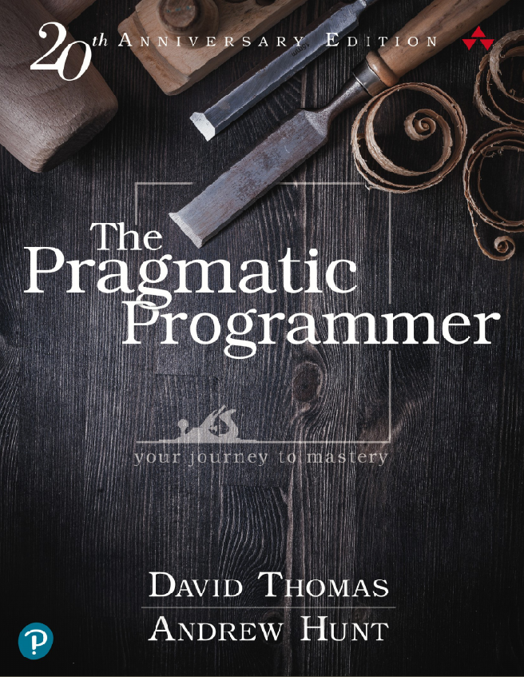

# PA1489 Grundläggande Mjukvaruutveckling / Basic Software Engineering

This is a 7.5 ECTS course offered by [Blekinge Institute of Technology](https://www.bth.se). The purpose of the course is to introduce a basic toolbox for a modern software engineer. The intention is to be made aware of the concepts and technologies and get some starting practice in using them. This will be followed up in subsequent courses where familiarity with the introduced concepts may be implicitly expected.

The course consists of Lectures, Written Assignments, and non-graded Advanced Exercises

## Learning Outcomes
(In swedish, since the [Syllabus](https://edu.bth.se/utbildning/utb_kursplaner.asp?sok=pa1489) is in swedish)

1. **Kunskap och förståelse**; Efter genomförd kurs ska studenten kunna:
   1.  Visa grundläggande kunskaper i modern mjukvaruutveckling och containerbaserad mjukvaruutveckling genom att skriftligt beskriva och sammanfatta erfarenheter och observationer från övningar och projekt.

2. **Färdighet och förmåga**; Efter genomförd kurs ska studenten kunna:
   1. Utifrån en specifikation utveckla, dokumentera, och presentera ett mjukvaruprojekt som exekverar på ett fåtal kommunicerande containers.
   2. Felsöka ett program med hjälp av testkod och en debugger.
   3. Samarbeta runt ett gemensamt utvecklingsprojekt med hjälp av konfigurationsverktyg.
   4. Hantera de verktyg och utvecklingsmiljöer som används vid utveckling och felsökning med containerbaserad mjukvaruutveckling.

3. **Värderingsförmåga och förhållningssätt**; Efter genomförd kurs ska studenten kunna:
   1. Skriftligt reflektera över sina lösningar och sitt användande av utvecklingsverktyg.

## Course Book
D. Thomas, A. Hunt, The Pragmatic Programmer, 20th Anniversary Edition, 2020. ISBN-10: 0-13-595705-2

## Lectures

1. [Introduction](Lectures/01-Introduction/AA-Introduction.org)
2. [The Computer and its Parts](Lectures/02-Computer-and-its-Parts/AA-Computer-and-its-Parts.org)
3. [Practical: Development Environment](Lectures/03-Practical-Development-Environment/AA-Practical-Development-Environment.org)
4. [Basic Tools](Lectures/04-Basic-Tools/AA-Basic-Tools.org)
5. [Configuration Management](Lectures/05-Configuration-Management/AA-Configuration-Management.org)
6. [Practical: Working with Git](Lectures/06-Practical-Working-With-Git/AA-Practical-Working-With-Git.org)
7. [Virtualisation](Lectures/07-Virtualisation/AA-Virtualisation.org)
8. [Development with Containers](Lectures/08-Container-Development/AA-Container-Development.org)
9. [Practical: Docker and Docker Compose](Lectures/09-Practical-Docker-Docker-Compose/AA-Practical-Docker-Docker-Compose.org)
10. [Testing and Debugging](Lectures/10-Testing-Debugging/AA-Testing-and-Debugging.org)
11. [Documentation](Lectures/11-Documentation/AA-Documentation.org)
12. [Practical: Testing and Debugging](Lectures/12-Practical-Testing-Debugging/AA-Practical-Testing-Debugging.org)
13. [User Interfaces](Lectures/13-User-Interfaces/AA-User-Interfaces.org)
14. [User Interfaces: Web and HTML](Lectures/14-UI-Web-HTML/AA-UI-Web-HTML.org)
15. [Practical: We develop a Console App](Lectures/14-Practical-Console-App/AA-Practical-Console-App.org)
16. [Storage: Files and Databases](Lectures/16-Storage-Files-Databases/AA-Storage-Files-Databases.org)
17. [Introduction to Java](Lectures/17-Introduction-Java/AA-Introduction-Java.org)
18. [Practical: We develop a Web App](Lectures/18-Practical-Web-App/AA-Practical-Web-App.org)

## Written Assignments
The Written Assignments are the examined parts of the course:

| Assignment           | Size   | Description                               |
|----------------------|--------|-------------------------------------------|
| Written Assignment 1 | 2.5 hp | Tools: Git, Docker, Testing and Debugging |
| Written Assignment 2 | 2.5 hp | Implementation and Documentation          |
| Written Assignment 3 | 2.5 hp | Engineering Diary                         |

- [Assignment Descriptions](Assignments/PA1489-Assignment-Descriptions.org)

## Advanced Exercises
The Advanced Exercises are not part of the grading. The intention is to offer hands on experience with the principles and technologies introduced through the lectures. Each lecture has some exercises associated with it.

These exercises make use of many different programming languages and environments. They also make use of slightly more advanced concepts than what you have been introduced to. This is intentional, to give you something to aim for. Feel free to update your engineering diary with concepts that you think you need to learn more about in order to become proficient in these exercises.

- [Summary of the Advanced Exercises](Assignments/PA1489-Advanced-Exercises.org)

The exercises make use of various projects as starting points:

- [SorterTool](https://codeberg.org/mickesv/SorterTool.git)
- [Java Ponies](https://codeberg.org/mickesv/JavaPonies.git)
- [QuoteFinder](https://github.com/mickesv/ProvisioningDeployment.git)
- [PonyVoter](https://codeberg.org/mickesv/PonyVoter.git)
- [Craic chat](https://codeberg.org/mickesv/craic.git)
- [Insert Statements for Pony Trading Cards Database](https://codeberg.org/mickesv/gists/raw/branch/main/TradingCards_insert.sql)
